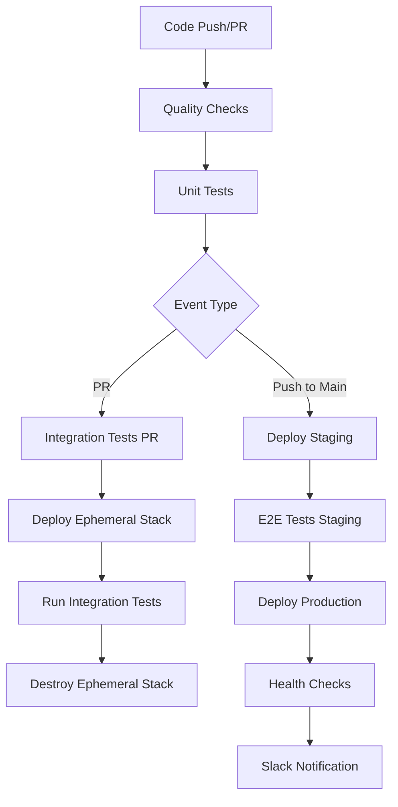

# GitHub Actions CI/CD Pipeline

This repository uses a comprehensive multi-stage CI/CD pipeline that ensures code quality, security, and reliable deployments.

## 🔄 Workflow Overview

### Trigger Events
- **Pull Requests**: Triggers quality checks, unit tests, and integration tests with ephemeral infrastructure
- **Push to Main**: Deploys to staging, runs E2E tests, then deploys to production (with approval)
- **Manual Dispatch**: Allows manual deployment to staging or production
- **Schedule**: Cleanup old PR stacks (optional)

## 🏗️ Pipeline Stages

### 1. Quality Checks (Always First)
- **ESLint**: Code style and Pulumi anti-patterns detection
- **TypeScript**: Compilation checks
- **Security Audit**: Dependency vulnerability scanning
- **Secret Detection**: TruffleHog scan for leaked secrets

### 2. Unit Tests
- Fast feedback with isolated component testing
- Code coverage reporting via Codecov
- No infrastructure dependencies

### 3. Integration Tests (PR Only)
- **Ephemeral Infrastructure**: Creates `pr-{number}` stack
- **Real AWS Resources**: Tests actual infrastructure behavior
- **Automatic Cleanup**: Destroys stack after tests (even on failure)
- **Concurrency Protection**: Only one test per PR at a time

### 4. Staging Deployment (Main Branch)
- **Automated Deployment**: No approval required
- **Health Checks**: Post-deployment validation
- **Environment Protection**: GitHub environment rules

### 5. End-to-End Tests (Staging)
- **Complete Pipeline Validation**: Document upload → processing → query
- **ESC Integration**: Uses Pulumi ESC for secure environment access
- **Artifact Collection**: Saves test results on failure

### 6. Production Deployment (Main Branch)
- **Manual Approval Required**: GitHub environment protection
- **Health Checks**: Comprehensive post-deployment validation
- **Slack Notifications**: Success/failure alerts
- **Rollback Ready**: Can quickly revert if issues arise

## 🔒 Security Features

### Environment Protection
- **PR Testing**: Isolated ephemeral stacks
- **Staging**: Automatic deployment with health checks
- **Production**: Manual approval required

### OIDC Authentication & ESC Integration
- **Token-less Authentication**: No long-lived secrets stored in GitHub
- **Short-lived Credentials**: 1-2 hour AWS token duration
- **Identity-based Access**: Uses GitHub identity for authentication
- **Environment Separation**: Separate AWS roles per environment
- **Complete Audit Trail**: Full visibility into deployments

### Security Scanning
- **TruffleHog**: Detects leaked credentials
- **npm audit**: Finds vulnerable dependencies
- **ESLint**: Catches Pulumi security anti-patterns

## 🧪 Test Suite Integration

### Our Test Types
```bash
# Unit Tests (Components only)
pnpm run test:unit          # Mocked, fast feedback

# Integration Tests (Real Infrastructure)
pnpm run test:integration   # AWS resources, IAM policies

# End-to-End Tests (Complete Pipeline)
pnpm run test:e2e          # Document → Query flow
```

### Test Environment Matrix
- **PR**: Ephemeral stack (`pr-{number}`)
- **Staging**: Persistent stack for E2E validation
- **Production**: Protected, manual approval only

## ⚙️ Configuration

### OIDC Setup Required

**Before using this workflow**, you must configure OIDC authentication:

1. **Follow the setup guide**: See `.pulumi/OIDC-SETUP.md` for detailed instructions
2. **Create AWS IAM roles** for each environment (pr, staging, production)
3. **Register GitHub OIDC issuer** in Pulumi Cloud
4. **Create Pulumi ESC environments** with the provided configurations
5. **Set repository variables** (not secrets) in GitHub

### Required GitHub Configuration

#### Variables (Repository Settings → Variables)
```yaml
PULUMI_ORGANIZATION         # Your Pulumi organization name
```

#### Secrets (Repository Settings → Secrets) 
```yaml
PINECONE_API_KEY           # Vector database (optional)
SLACK_WEBHOOK_URL          # Notifications (optional)
```

#### OIDC Authentication (No Secrets Required!)
- **Pulumi Access Token**: Obtained via OIDC authentication
- **AWS Credentials**: Injected via Pulumi ESC environments
- **Short-lived Tokens**: 1-2 hour duration for security

### GitHub Environments
Create these environments in your repository settings:

1. **pr-testing**
   - No protection rules
   - Used for ephemeral PR stacks

2. **staging**
   - Auto-deploy from main branch
   - Basic health checks required

3. **production**
   - **Required reviewers**: Senior developers
   - **Wait timer**: 5 minutes minimum
   - **Branch protection**: main only

## 🚀 Deployment Flow



## 📊 Performance Optimizations

### Caching Strategy
- **pnpm cache**: Dependencies cached by lockfile hash
- **Node modules**: Restored from cache when possible
- **Docker layers**: Multi-stage builds (if applicable)

### Parallel Execution
- Quality checks run independently
- Multiple test suites can run simultaneously
- Deployment and testing are pipelined

### Resource Management
- **Concurrency groups**: Prevent resource conflicts
- **Timeout limits**: Prevent hanging jobs
- **Automatic cleanup**: Remove old PR stacks

## 🔧 Customization

### Adding New Test Types
1. Add npm script in `package.json`
2. Create new job in workflow
3. Set appropriate `needs:` dependencies
4. Configure timeout and environment

### Modifying Environments
1. Update GitHub environment settings
2. Adjust workflow `environment:` fields
3. Update secret configurations
4. Test with manual dispatch

### Custom Health Checks
Replace placeholder health checks with:
```bash
# API endpoint testing
curl -f $API_ENDPOINT/health

# Database connectivity
pulumi stack output --stack staging | jq -r '.databaseUrl' | xargs -I {} curl {}

# Custom validation scripts
./scripts/validate-deployment.sh
```

## 🐛 Troubleshooting

### Common Issues

**Tests failing in PR but not locally:**
- Check AWS credentials in PR environment
- Verify ephemeral stack creation
- Review resource naming conflicts

**E2E tests timing out:**
- Increase timeout in workflow
- Check infrastructure deployment time
- Verify ESC environment configuration

**Production deployment stuck:**
- Check environment protection rules
- Verify reviewer availability
- Review deployment logs

### Debug Commands
```bash
# Check stack status
pulumi stack ls --all

# View recent deployments
gh run list --workflow=ci-cd.yml

# Download workflow logs
gh run download <run-id>
```

## 📈 Metrics & Monitoring

### Success Metrics
- **Pipeline Success Rate**: Target >95%
- **Deployment Frequency**: Multiple times per day
- **Lead Time**: PR merge to production <2 hours
- **Recovery Time**: <15 minutes for rollbacks

### Monitoring Integration
- GitHub Actions built-in metrics
- Slack notifications for key events
- Pulumi Cloud deployment history
- AWS CloudWatch for infrastructure health

---

## 🤝 Contributing

When contributing to this pipeline:

1. **Test Changes**: Use manual dispatch to test workflow changes
2. **Update Documentation**: Keep this README current
3. **Review Security**: Ensure no secrets in workflow files
4. **Performance**: Consider caching and parallel execution
5. **Environments**: Test against staging before production changes