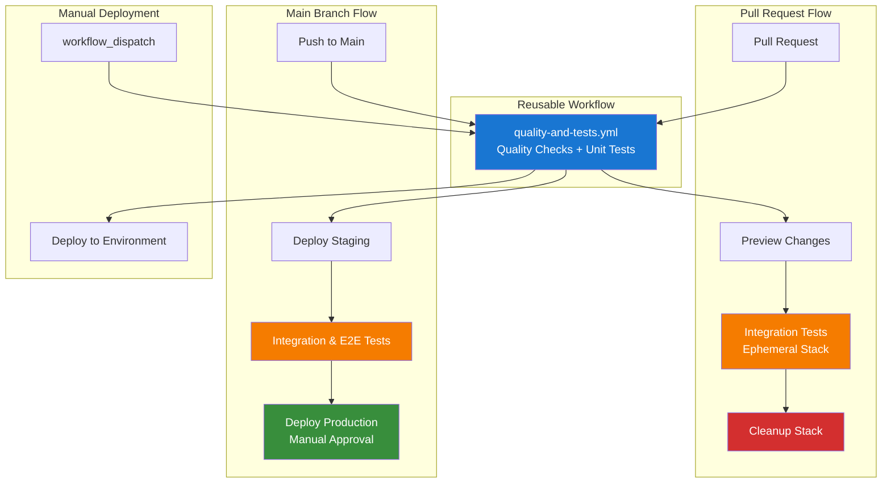

# GitHub Actions CI/CD Pipeline

Multi-stage pipeline ensuring code quality, security, and reliable deployments.

## 📁 Workflow Files

- **`quality-and-tests.yml`** - Reusable workflow for quality checks and unit tests
- **`pr.yml`** - Pull request validation with ephemeral infrastructure
- **`push.yml`** - Main branch deployment (staging → production)

## 🔄 Pipeline Flow

**Pull Requests**: Quality checks → Unit tests → Integration tests (ephemeral stack)
**Push to Main**: Quality checks → Unit tests → Deploy staging → E2E tests → Deploy production
**Manual**: Quality checks → Unit tests → Deploy to selected environment

## 🚀 Workflow Architecture



## 🔧 Key Features

**Reusable Workflow**: `quality-and-tests.yml` eliminates code duplication - quality checks and unit tests defined once, used by both PR and push workflows.

**Security**: OIDC authentication, short-lived tokens, ephemeral PR stacks with automatic cleanup.

**Testing**: Unit tests → Integration tests (real AWS) → E2E tests (full pipeline).

## ⚙️ Setup

1. Configure OIDC authentication (see `.pulumi/OIDC-SETUP.md`)
2. Create GitHub environments: `pr-testing`, `staging`, `production`
3. Set repository variable: `PULUMI_ORGANIZATION`

## 🐛 Troubleshooting

```bash
# Check stack status
pulumi stack ls --all

# View workflow runs
gh run list --workflow=push.yml

# Download logs
gh run download <run-id>
```