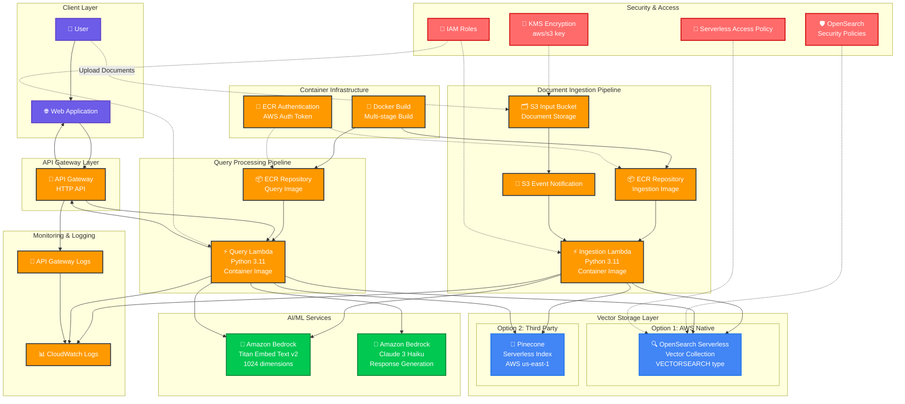

# AWS RAG Pipeline - High Level Design

## Architecture Components

### 🔄 **Data Flow**

1. **Container Build & Deployment Path**:
   - Docker images built → ECR repositories
   - Lambda functions deployed → Container images with digest hashes
   - Python 3.11 runtime → LangChain + OpenSearch dependencies

2. **Document Ingestion Path**:
   - User uploads documents → S3 Input Bucket
   - S3 Event triggers → Ingestion Lambda (Python container)
   - Lambda processes document → Bedrock Embedding (Titan v2)
   - Document chunking → RecursiveCharacterTextSplitter
   - Embeddings stored → Vector Database (OpenSearch/Pinecone)

3. **Query Processing Path**:
   - User query → API Gateway → Query Lambda (Python container)
   - Lambda generates query embedding → Bedrock Titan
   - Vector similarity search → Vector Database
   - Results + LLM generation → Bedrock Claude 3 Haiku
   - Response returned → API Gateway → User

### 🏗️ **Key Components**

| Component | Type | Purpose | Configuration |
|-----------|------|---------|---------------|
| **S3 Input Bucket** | Storage | Document ingestion | Server-side encryption |
| **ECR Repositories** | Registry | Container images | Ingestion & Query images |
| **Ingestion Lambda** | Compute | Document processing | Python 3.11 container, 15min timeout, 1024MB |
| **Query Lambda** | Compute | Query processing | Python 3.11 container, 3min timeout, 1024MB |
| **API Gateway** | Interface | HTTP API endpoint | CORS enabled |
| **Vector Store** | Database | Embedding storage | OpenSearch/Pinecone configurable |
| **Bedrock** | AI/ML | Embeddings + LLM | Titan v2 + Claude 3 Haiku |
| **Docker Build** | CI/CD | Container packaging | Multi-arch builds, binary wheels |

### ⚙️ **Configuration Options**

- **Runtime**: Python 3.11 with containerized deployment
- **Vector Store Type**: `opensearch` (default) or `pinecone` 
- **Embedding Model**: Amazon Titan Embed Text v2 (1024 dimensions)
- **LLM Model**: Claude 3 Haiku (response generation)
- **Container Registry**: ECR with image digest-based deployments
- **Dependencies**: LangChain, OpenSearchPy, Boto3 with binary wheels
- **Security**: Conditional IAM policies based on vector store type

### 🔒 **Security Features**

- **Principle of Least Privilege**: IAM policies only include permissions for selected vector store
- **Container Security**: ECR repositories with AWS authentication and digest-based deployments
- **Encryption**: S3 server-side encryption with AWS managed keys
- **Network Security**: OpenSearch security policies for network access control
- **API Security**: Lambda-based API with proper CORS configuration
- **Runtime Isolation**: Containerized Lambda execution environment

### 📊 **Monitoring & Observability**

- CloudWatch logs for all Lambda functions
- API Gateway access logs  
- Vector store operation metrics
- Container build and deployment logs
- Error tracking and alerting capabilities

### 🐳 **Container Architecture Details**

- **Base Image**: `public.ecr.aws/lambda/python:3.11`
- **Package Management**: Binary-only pip installations (`--only-binary=:all:`)
- **Dependencies**: LangChain 0.3.27, OpenSearchPy 3.0.0, Boto3 1.40.2+
- **Build Strategy**: Multi-stage builds with dependency caching
- **Deployment**: Image digest-based references for immutable deployments
- **Registry**: Private ECR repositories with lifecycle policies