# AWS RAG Pipeline - High Level Design

## System Overview

```mermaid
graph LR
    User[👤 User] --> Ingest[📄 Document Ingestion]
    User --> Query[🔍 Query Processing]
    
    Ingest --> Store[🗃️ Vector Store]
    Query --> Store
    Query --> Response[💬 AI Response]
    
    classDef userFlow fill:#6C5CE7,stroke:#5F3DC4,stroke-width:2px,color:#FFFFFF
    classDef pipeline fill:#FF9900,stroke:#232F3E,stroke-width:2px,color:#FFFFFF
    classDef storage fill:#4285F4,stroke:#1a73e8,stroke-width:2px,color:#FFFFFF
    classDef ai fill:#00C851,stroke:#007E33,stroke-width:2px,color:#FFFFFF
    
    class User userFlow
    class Ingest,Query pipeline
    class Store storage
    class Response ai
```

## Pipeline Architecture

```mermaid
graph TB
    subgraph "Document Ingestion Pipeline"
        S3[📁 S3 Bucket]
        IngestLambda[⚡ Ingestion Lambda<br/>Python + LangChain]
        S3 --> IngestLambda
    end
    
    subgraph "Query Processing Pipeline" 
        API[🔌 API Gateway]
        QueryLambda[⚡ Query Lambda<br/>Python + LangChain]
        API --> QueryLambda
    end
    
    subgraph "AI/ML Services"
        Bedrock[🧠 Amazon Bedrock<br/>Embeddings + LLM]
    end
    
    subgraph "Vector Storage"
        VectorDB[(🗃️ Vector Database<br/>OpenSearch or Pinecone)]
    end
    
    IngestLambda --> Bedrock
    IngestLambda --> VectorDB
    QueryLambda --> Bedrock  
    QueryLambda --> VectorDB
    
    classDef aws fill:#FF9900,stroke:#232F3E,stroke-width:2px,color:#FFFFFF
    classDef ai fill:#00C851,stroke:#007E33,stroke-width:2px,color:#FFFFFF
    classDef storage fill:#4285F4,stroke:#1a73e8,stroke-width:2px,color:#FFFFFF
    
    class S3,API,IngestLambda,QueryLambda aws
    class Bedrock ai
    class VectorDB storage
```

## Data Flow Diagram

### Data Flow Process

**Document Ingestion**:
1. User uploads document to S3 bucket
2. S3 event triggers containerized Lambda function
3. Lambda chunks document and generates embeddings via Bedrock
4. Embeddings stored in vector database (OpenSearch/Pinecone)

**Query Processing**:
1. User sends query via API Gateway
2. Lambda generates query embedding via Bedrock
3. Vector similarity search retrieves relevant documents
4. LLM generates contextual response using retrieved documents
5. Response returned to user

## Key Components

| Component | Purpose | Technology |
|-----------|---------|------------|
| **S3 Bucket** | Document storage and ingestion trigger | AWS S3 with event notifications |
| **Ingestion Lambda** | Document processing and embedding generation | Python + LangChain + Bedrock |
| **Query Lambda** | Query processing and response generation | Python + LangChain + Bedrock |
| **API Gateway** | HTTP API for query requests | AWS API Gateway v2 |
| **Vector Database** | Embedding storage and similarity search | OpenSearch Serverless or Pinecone |
| **Amazon Bedrock** | AI services for embeddings and LLM | Titan Embeddings + Claude 3 |

## Technology Stack

- **Runtime**: Python 3.11 with containerized Lambda deployment
- **AI Framework**: LangChain for RAG pipeline orchestration
- **Embeddings**: Amazon Titan Embed Text v2 (1024 dimensions)
- **LLM**: Claude 3 Haiku for response generation
- **Vector Store**: Configurable (OpenSearch Serverless or Pinecone)
- **Container Registry**: Amazon ECR with digest-based deployments
- **Infrastructure**: Pulumi with TypeScript for IaC