# AWS RAG Pipeline - High Level Design

```mermaid
graph TB
    subgraph "Client Layer"
        User[👤 User]
        WebApp[🌐 Web Application]
    end

    subgraph "API Gateway Layer"
        API[🔌 API Gateway<br/>HTTP API]
    end

    subgraph "Document Ingestion Pipeline"
        S3Input[🗂️ S3 Input Bucket<br/>Document Storage]
        S3Event[📡 S3 Event Notification]
        IngestionLambda[⚡ Ingestion Lambda<br/>Node.js 18.x]
    end

    subgraph "Query Processing Pipeline"
        QueryLambda[⚡ Query Lambda<br/>Node.js 18.x]
    end

    subgraph "AI/ML Services"
        BedrockEmbed[🧠 Amazon Bedrock<br/>Titan Embed Text v2<br/>1024 dimensions]
        BedrockLLM[🤖 Amazon Bedrock<br/>Claude 3 Haiku<br/>Response Generation]
    end

    subgraph "Vector Storage Layer"
        subgraph "Option 1: AWS Native"
            OpenSearch[🔍 OpenSearch Serverless<br/>Vector Collection<br/>VECTORSEARCH type]
        end
        subgraph "Option 2: Third Party"
            Pinecone[🌲 Pinecone<br/>Serverless Index<br/>AWS us-east-1]
        end
    end

    subgraph "Security & Access"
        IAMRoles[🔐 IAM Roles]
        SecurityPolicies[🛡️ OpenSearch<br/>Security Policies]
        ServerlessAccess[🔑 Serverless Access Policy]
        KMS[🔐 KMS Encryption<br/>aws/s3 key]
    end

    subgraph "Monitoring & Logging"
        CloudWatch[📊 CloudWatch Logs]
        APILogs[📝 API Gateway Logs]
    end

    %% User Interactions
    User --> WebApp
    WebApp --> API
    User -.->|Upload Documents| S3Input

    %% Ingestion Flow
    S3Input --> S3Event
    S3Event --> IngestionLambda
    IngestionLambda --> BedrockEmbed
    IngestionLambda --> OpenSearch
    IngestionLambda --> Pinecone
    IngestionLambda --> CloudWatch

    %% Query Flow
    API --> QueryLambda
    QueryLambda --> BedrockEmbed
    QueryLambda --> BedrockLLM
    QueryLambda --> OpenSearch
    QueryLambda --> Pinecone
    QueryLambda --> CloudWatch
    QueryLambda --> API
    API --> WebApp

    %% Security Relationships
    IAMRoles -.-> IngestionLambda
    IAMRoles -.-> QueryLambda
    SecurityPolicies -.-> OpenSearch
    ServerlessAccess -.-> OpenSearch
    KMS -.-> S3Input

    %% Monitoring
    API --> APILogs
    APILogs --> CloudWatch

    %% Styling
    classDef awsService fill:#FF9900,stroke:#232F3E,stroke-width:2px,color:#FFFFFF
    classDef lambdaService fill:#FF9900,stroke:#232F3E,stroke-width:2px,color:#FFFFFF
    classDef vectorStore fill:#4285F4,stroke:#1a73e8,stroke-width:2px,color:#FFFFFF
    classDef aiService fill:#00C851,stroke:#007E33,stroke-width:2px,color:#FFFFFF
    classDef security fill:#FF6B6B,stroke:#CC0000,stroke-width:2px,color:#FFFFFF
    classDef client fill:#6C5CE7,stroke:#5F3DC4,stroke-width:2px,color:#FFFFFF

    class S3Input,API,CloudWatch,APILogs,S3Event awsService
    class IngestionLambda,QueryLambda lambdaService
    class OpenSearch,Pinecone vectorStore
    class BedrockEmbed,BedrockLLM aiService
    class IAMRoles,SecurityPolicies,ServerlessAccess,KMS security
    class User,WebApp client
```

## Architecture Components

### 🔄 **Data Flow**

1. **Document Ingestion Path**:
   - User uploads documents → S3 Input Bucket
   - S3 Event triggers → Ingestion Lambda
   - Lambda processes document → Bedrock Embedding
   - Embeddings stored → Vector Database (OpenSearch/Pinecone)

2. **Query Processing Path**:
   - User query → API Gateway → Query Lambda
   - Lambda generates query embedding → Bedrock
   - Vector similarity search → Vector Database
   - Results + LLM generation → Bedrock Claude
   - Response returned → API Gateway → User

### 🏗️ **Key Components**

| Component | Type | Purpose | Configuration |
|-----------|------|---------|---------------|
| **S3 Input Bucket** | Storage | Document ingestion | Server-side encryption |
| **Ingestion Lambda** | Compute | Document processing | Node.js 18.x, 5min timeout |
| **Query Lambda** | Compute | Query processing | Node.js 18.x, 1min timeout |
| **API Gateway** | Interface | HTTP API endpoint | CORS enabled |
| **Vector Store** | Database | Embedding storage | OpenSearch/Pinecone configurable |
| **Bedrock** | AI/ML | Embeddings + LLM | Titan + Claude models |

### ⚙️ **Configuration Options**

- **Vector Store Type**: `opensearch` (default) or `pinecone`
- **Embedding Model**: Amazon Titan Embed Text v2 (1024 dimensions)
- **LLM Model**: Claude 3 Haiku (response generation)
- **Security**: Conditional IAM policies based on vector store type

### 🔒 **Security Features**

- **Principle of Least Privilege**: IAM policies only include permissions for selected vector store
- **Encryption**: S3 server-side encryption with AWS managed keys
- **Network Security**: OpenSearch security policies for network access control
- **API Security**: Lambda-based API with proper CORS configuration

### 📊 **Monitoring & Observability**

- CloudWatch logs for all Lambda functions
- API Gateway access logs
- Vector store operation metrics
- Error tracking and alerting capabilities